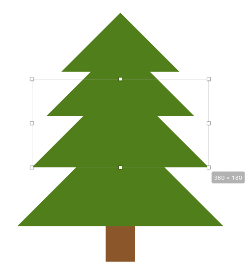
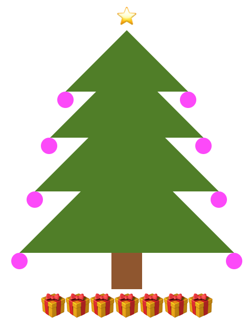
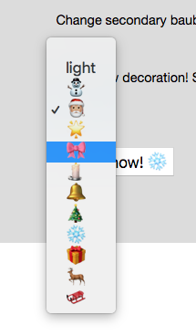
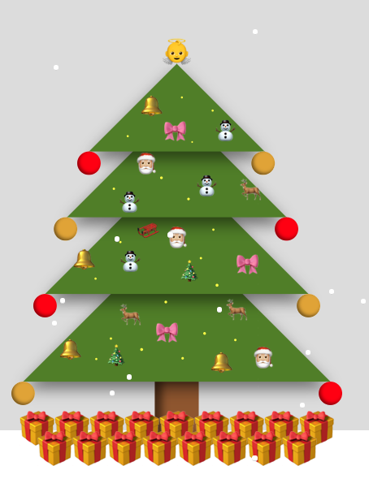
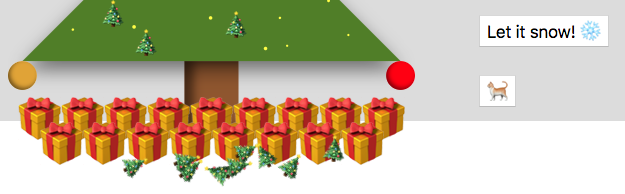
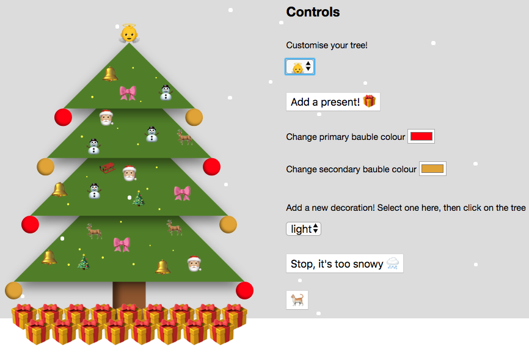

# Emoji Tree Decorator
🎄A customisable Christmas tree!

### Created svg tree
First of all, I created a basic tree in Sketch. As you can see it’s comprised of four overlapping, mathematically beautiful right-angled triangles. Later, I added a few shadows to each triangle (with some inner shadows for the baubles) to make it look marginally more realistic, and this code got rather more complex.


```
<svg width="420px" height="507px" viewBox="0 0 420 507">
    <g id="Artboard" stroke="none" stroke-width="1" fill="none" fill-rule="evenodd">
        <polygon id="Triangle" fill="#507E1A" points="210 0 330 120 90 120"></polygon>
        <polygon id="Triangle" fill="#507E1A" points="210 60 360 210 60 210"></polygon>
        <polygon id="Triangle" fill="#507E1A" points="210 135 390 315 30 315"></polygon>
        <polygon id="Triangle" fill="#507E1A" points="210 225 420 435 0 435"></polygon>
        <rect id="Rectangle" fill="#8B572A" x="180" y="435" width="60" height="72"></rect>
    </g>
</svg>
```
### Added tree topper selector
I started off with something basic, which was the decoration to sit at the top of the tree. Traditionally, this is either a star or an angel, although the Apple angel emoji is a quite creepy baby with wings but no body, so that's why the star is the default. When the option selected in this control changes, the handleChange function sets that as the textContent of the topSelector div. Easy!
```
<div class="controls">
	<select name="toppers">
		<option value="⭐">⭐</option>
		<option value="👼">👼</option>
	</select>
</div>
...
<script>
	const topSelector = document.querySelector('select');
	const topper = document.querySelector('.topper');
	function handleChange() {
		topper.textContent = topSelector.value;
	}
	topSelector.addEventListener('change', handleChange);
</script>
```

### Added Add Present
In a similar vein, I added an event listener to a button labelled "Add present", which adds a present emoji to the textContent of the present container (making sure to set its width to match that of the tree, or it all ends up a mess).



### Baubles
Time to make things a bit more interesting. I went back to Sketch to add baubles on each branch, then set about letting the user set their colour. This was done with custom CSS properties, which are set on the root element with the prefix `--`...
```
:root {
	--primary-colour: #ff0000;
	--secondary-colour: #DAA520;
}
```
...referenced in the fill attribute for each bauble using the `var()` function...
```
<circle cx="106" fill="var(--primary-colour)" cy="136" r="16"></circle>
<circle cx="346" fill="var(--secondary-colour)" cy="136" r="16"></circle>
<circle cx="74" fill="var(--secondary-colour)" cy="226" r="16"></circle>
<circle cx="376" fill="var(--primary-colour)" cy="226" r="16"></circle>
<circle cx="46" fill="var(--primary-colour)" cy="331" r="16"></circle>
<circle cx="406" fill="var(--secondary-colour)" cy="331" r="16"></circle>
<circle cx="16" fill="var(--secondary-colour)" cy="451" r="16"></circle>
<circle cx="436" fill="var(--primary-colour)" cy="451" r="16"></circle>
```
...and controlled via the values of a couple of colour pickers which have 'change' event listeners set on them.
```
const colourPickers = document.querySelectorAll('.colour-picker');
function changeColour() {
	document.documentElement.style.setProperty(`--${this.name}`, this.value);
}
colourPickers.forEach(picker => picker.addEventListener('change', changeColour));
```

### Decorations
Once it was 3-D the tree called out for more decorations. I added a 'click' event listener to the tree itself that adds a div to the DOM, setting its top and left values according to the coordinates of the MouseEvent (e.clientX and e.clientY). Its textContent is set to the value of a `<select>` element, filled with an increasing variety of emojis that vaguely resemble Christmassy ornaments.


```
const decSelector = document.querySelector('.decorations');
const tree = document.querySelector('.tree-container');
function placeDecoration(e) {
	if (decSelector.value !== "") {
		const decoration = document.createElement('div');
		decoration.textContent = decSelector.value;
		decoration.classList.add('decoration');
		// minus 15 to account for the decorations’ size of 30px
		decoration.setAttribute("style", `top: ${e.clientY}px; left: ${e.clientX - 15}px;`);
		tree.appendChild(decoration);
		decoration.setAttribute("x", `${e.clientY}`);
		decoration.setAttribute("y", `${e.clientX}`);
		tree.appendChild(decoration);
	}
}
mainTree.addEventListener('click', placeDecoration);
```
Being absolutely positioned, the decorations didn’t really work when the browser later got resized. I sneakily solved this problem by moving the tree into the top left, after an embarrassingly long time trying to add new svg text elements to the tree instead.
When I came to add lights (i.e. `<circle />`s with a radius of 1px) I worked out the trick behind this, which wasn’t all that difficult: `const light = document.createElementNS("http://www.w3.org/2000/svg", 'circle');` rather than `const light = document.createElement('circle');`

### Twinkly lights
Next, I wanted to make the lights twinkly. This was done with a function that changes the radius of each one every 500 milliseconds, selecting a random number of pixels between 1 and 2.
```
function twinkle() {
	if (lightsContainer.hasChildNodes()) {
		Array.from(lightsContainer.querySelectorAll('circle')).forEach(light => {
			light.setAttribute('r', `${Math.random()+1}`);
		});
	}
}
setInterval(twinkle, 500);
twinkle();
```
### Let it snow
For some reason, I decided to conjure up JavaScript snow, using a "Let it snow! ❄️" button to call `letItSnow()`, which includes two nested functions, `createFlake()` and `snowfall()`.
`createFlake()` creates an absolutely positioned `<div>` which starts off with its top set to 0px, and left set to a random number within the width of the screen. `snowfall()` increases the `top` value by 1px at a random interval, so each one falls down the screen at their own speed.

This was lovely but as the flakes kept falling forever it made my laptop whir quite a lot, so I made each flake remove itself from the DOM when its top exceeded the height of the tree. This led to a few simple styling changes to add some snowy ground (a white div with a width of 100%), and a limit on the number of presents so they wouldn't look silly with snow disappearing halfway down them.

As the whirring persisted I set about making it possible to stop new snow being created. Originally this was attempted using the same button, which toggled its textContent from "Let it snow! ❄️" to "Stop, it's too snowy 🌨️" when clicked, and used this textContent value to determine what function to perform. This all got horribly confusing and led me to look into various solutions, such as a simple `return;` to exit the `letItSnow()` function, and custom errors with a throw statement.

None of this worked, and what I had missed was that the two buttons have to do two separate things - `letItSnow()` and `stopSnow()`. This was also much easier once they were actually two different buttons (which each toggle the other to `display: none;`, so they appear to be the same button). Crucially, they do both need to refer to `snowing`, the value returned by setting an interval on the `createFlake()` function, so I had to set `snowing = null` in global scope.



```
const snowButton = document.getElementById('snow-button');
const stopButton = document.getElementById('stop-button');
const snowContainer = document.querySelector('.snow-container');
let snowing = null;

function letItSnow() {
	stopButton.classList.remove("hidden-button");
	snowButton.classList.add("hidden-button");
	function createFlake() {
		let flake = document.createElement('div');
		flake.classList.add('snowflake');
		\\ Start off at the top of the window...
		flake.style.top = '0px';
		\\ Start off at a random distance across the width of the window...
		flake.style.left = `${Math.random() * window.innerWidth}px`;
		snowContainer.appendChild(flake);
		function snowfall() {
			\\ Get the *number* of pixels from the top (take 'px' off the end)...
			let topValue = parseInt(flake.style.top.slice(0, flake.style.top.length-2), 10);
			\\ Add another pixel to the top if less than the height of the tree...
			if (topValue < 650) {
				flake.style.top = `${topValue + 1}px`;
			} else {
				flake.remove();
			}
		}
		setInterval(snowfall, (Math.random() * 100) + 10);
		snowfall();
	}

	snowing = setInterval(createFlake, 2000);
}

function stopSnow() {
	snowButton.classList.remove("hidden-button");
	stopButton.classList.add("hidden-button");
	clearInterval(snowing);
}
snowButton.addEventListener('click', letItSnow);
stopButton.addEventListener('click', stopSnow);
```
 
### Cat Button
At the request of a colleague I added a cat into the mix, which knocks decorations off. The suggestion was actually to throw a cat into the tree, but I thought that was a bit too ambitious and cruel.


```
const catButton = document.getElementById("cat-button");
function dropDecs() {
	\\ Take every other decoration on the tree
	Array.from(document.querySelectorAll(".decoration")).filter((dec, index) => index % 2 === 1).forEach(decoration => {
		\\ Set the top value of each one to a random number somewhere around the base of the tree
		decoration.style.top = `${(Math.random()*30)+610}px`;
		\\ Rotate each one up to 90 degrees clockwise or anticlockwise
		decoration.style.transform = `rotate(${(Math.random()*180)-90}deg)`;
	});
}
catButton.addEventListener('click', dropDecs);
```


